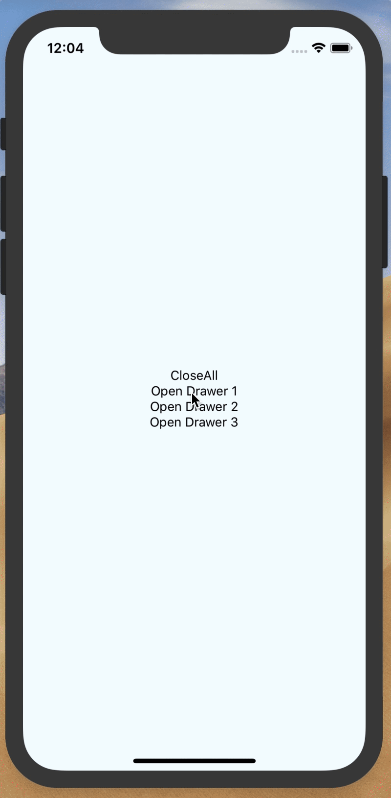

# react-native-bottom-drawer

<p align="center">
  
</p>


React native bottom drawer component


## Installation

Install `react-native-bdrawer`.

```
yarn add react-native-bdrawer
```

## Usage Example
(go to the example folder for a more fleshed out example)

```javascript
import React from 'react';
import { View, Text, TouchableOpacity } from 'react-native';
import BottomDrawer from 'react-native-bdrawer';

class Example extends Component {
	render() {
		return (
			<View>
				<TouchableOpacity onPress={() => this.refs.Drawer.open()}>
					<Text>Open Drawer</Text>
				</TouchableOpacity>

				<BottomDrawer ref="Drawer" containerHeight={300}>
					<Text>Hello</Text>
				</BottomDrawer>
			</View>
		);
	}
}
```


## Configuration

| Prop | Type | Default | Description |
| ---- | ---- | ----| ---- |
| containerHeight | number | -- | The height of the drawer. | 
| backgroundColor | string | '#f5f7f9' | The background color of the drawer. |
| startUp | bool | false | If **true**, the drawer will start in up position. If **false**, it will start in down position. |
